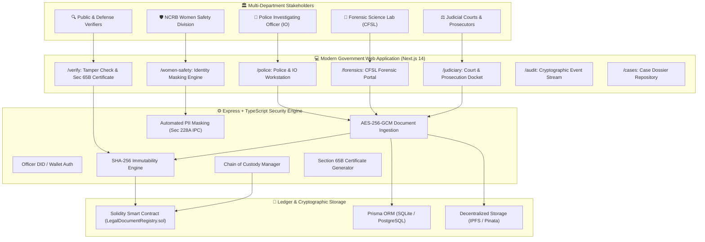

# 🏛️ SakshyaVault (NyayDMS / NCRB LegiChain)
### Secure Digital Document Management & Evidence Integrity System

[](https://www.mha.gov.in)
[](https://ncrb.gov.in)
[](https://github.com/maitree2005/SakshyaVault)
[](https://github.com/maitree2005/SakshyaVault)
[](https://github.com/maitree2005/SakshyaVault)

---

## 📌 Problem Overview & Context

Law enforcement agencies, forensics laboratories, prosecutors, judicial courts, and the **National Crime Records Bureau (NCRB)** handle massive volumes of sensitive legal and investigation documents:
- **First Information Reports (FIRs)**
- **Police Case Diaries** (Section 172 CrPC / Section 192 BNSS)
- **Seizure Memos & Panchnamas**
- **Forensic Science Laboratory (CFSL) Reports** (Cyber, Ballistic, DNA, Toxicology)
- **Witness & Victim Depositions** (Section 161/164 CrPC)
- **Charge Sheets** (Section 173 CrPC / Section 193 BNSS)
- **Bail Orders, Court Judgments, and Summons**

### Traditional Vulnerabilities Solved:
1. **Document Tampering Risks**: Single-bit alterations or forged documents during inter-department transit.
2. **Broken Chain of Custody**: Inability to prove physical and digital possession timeline in court.
3. **Delayed Court Admissibility**: Challenges in obtaining valid Section 65B Electronic Evidence certificates.
4. **Victim Identity Leaks**: Accidental public disclosure of sensitive victim/witness data in violation of Section 228A IPC and POCSO statutory guidelines.

---

## 🏗️ System Architecture



---

## 🌟 Key Functional Pillars

### 1. 🔗 Solidity Smart Contract Registry (`LegalDocumentRegistry.sol`)
- Anchors SHA-256 cryptographic fingerprints of all legal documents onto the blockchain ledger.
- Enforces role-based permissions: `POLICE_ROLE`, `FORENSIC_ROLE`, `JUDICIARY_ROLE`, `NCRB_ADMIN_ROLE`.
- Verifies document existence, block timestamp, uploader identity, version, and revocation status in O(1) gas complexity.

### 2. 📜 Section 65B Indian Evidence Act / Section 63 BSA Admissibility
- Automated generation of court-admissible electronic record certificates under Section 65B(4) of the Indian Evidence Act, 1872 (Section 63 of Bharatiya Sakshya Adhiniyam, 2023).
- Includes certifying officer sworn statement, computer device details, blockchain transaction hash, and tamper-proof verification seal.

### 3. ⛓️ Unbroken Chain-of-Custody (CoC) Tracking
- Tracks every physical and digital evidence transfer across police stations, forensic laboratories, and courts.
- Logs transferring custodian, recipient, reason for handover, facility location, and cryptographic officer signature with interactive timeline visualization.

### 4. 🛡️ NCRB Women Safety Division (Sec 228A IPC & POCSO Protection)
- Automated PII Redaction Engine: Automatically detects and masks victim names, residential addresses, phone numbers, and Aadhaar numbers.
- Computes blinded cryptographic commitments of the original statement to maintain full evidentiary authenticity in judicial proceedings without violating victim confidentiality.

### 5. ⚡ Live Cryptographic Tamper-Detection Engine
- Real-time drag-and-drop file verifier. If even a single byte or comma is modified, the engine flags **"TAMPERING DETECTED"** with visual mismatch proof.

---

## 📂 Repository Structure

```
SakshyaVault/
├── contracts/                        # Smart Contracts & Blockchain
│   ├── src/
│   │   ├── LegalDocumentRegistry.sol # Core Legal Document & Custody Registry
│   │   └── ...
│   ├── scripts/
│   │   └── deploy-legal.ts           # Hardhat deployment script
│   └── hardhat.config.ts
├── backend/                          # Backend API (Node.js + Express + TypeScript)
│   ├── prisma/
│   │   ├── schema.prisma             # SQLite / PostgreSQL Schema
│   │   └── seed-legal.ts             # Realistic Case & Evidence Seed Data
│   ├── src/
│   │   ├── controllers/              # LegalCase, LegalDocument, Integrity, WomenSafety
│   │   ├── routes/                   # RESTful API Endpoints
│   │   └── services/                 # Encryption, Blockchain, IPFS, Audit
│   └── package.json
├── frontend/                         # Modern Web Application (Next.js 14)
│   ├── app/
│   │   ├── page.tsx                  # National Landing Portal & Quick Verifier
│   │   ├── cases/                    # Case Dossier Repository & [id] Evidence Vault
│   │   ├── police/                   # Investigating Officer (IO) Workstation
│   │   ├── forensics/                # CFSL Forensic Science Laboratory Portal
│   │   ├── judiciary/                # Court & Prosecution Evidence Docket
│   │   ├── women-safety/             # NCRB Women Safety Division PII Redaction
│   │   ├── verify/                   # Instant Tamper Verifier & Sec 65B Certificate
│   │   └── audit/                    # National Cryptographic Event Stream
│   ├── components/                   # TopNav, Footer, Modals
│   └── package.json
├── docs/                             # Architecture & Workflow Diagrams
└── README.md
```

---

## 🚀 Quick Start Guide

### Prerequisites
- **Node.js** ≥ 18.0.0
- **npm** ≥ 9.0.0
- *(Optional)* Hardhat Node or Ethereum Testnet wallet

### 1. Clone the Repository
```bash
git clone https://github.com/maitree2005/SakshyaVault.git
cd SakshyaVault
```

### 2. Configure Environment
Create `.env` in the root folder (or use `.env.example`):
```bash
cp .env.example .env
```
*(Default settings are pre-configured for instant zero-dependency SQLite local execution)*.

### 3. Setup & Seed Backend Database
```bash
cd backend
npm install
npx prisma db push
npx ts-node prisma/seed-legal.ts
npm run dev
```
> Backend runs at `http://localhost:3001`

### 4. Run Frontend Application
Open a new terminal:
```bash
cd frontend
npm install
npm run dev
```
> Access the portal at `http://localhost:3000`

---

## 🏛️ Specialized Department Routes

| Department | Route | Functionality |
|---|---|---|
| **National Portal** | `/` | Live statistics, quick on-chain verifier, and role gateways |
| **Case Directory** | `/cases` | Filter investigation dockets by status, police station, or sensitivity |
| **Evidence Vault** | `/cases/:id` | Full case dossier, exhibit hashes, and interactive chain of custody |
| **Police (IO)** | `/police` | Register new FIRs, record Case Diary entries, and anchor evidence |
| **Forensics (CFSL)** | `/forensics` | Submit scientific lab examination reports with examiner signature |
| **Judiciary** | `/judiciary` | Review prosecution evidence, record bail orders, and trial judgments |
| **NCRB Women Safety** | `/women-safety` | Automated PII redaction engine under Section 228A IPC & POCSO Act |
| **Evidence Verifier** | `/verify` | SHA-256 tamper check & Section 65B Certificate printable generator |
| **Audit Trail** | `/audit` | Real-time immutable event log of all system activities |

---

## 📜 Statutory & Legal Compliance

- **Section 65B(4), Indian Evidence Act, 1872**: Mathematical proof of computer integrity and electronic record retention.
- **Section 63, Bharatiya Sakshya Adhiniyam, 2023**: Electronic record admissibility in modern criminal trials.
- **Section 172, Code of Criminal Procedure (CrPC)** / **Section 192 BNSS**: Day-to-day police case diary maintenance.
- **Section 228A, Indian Penal Code (IPC)** / **Section 72 BNS, 2023**: Non-disclosure of victim identity in sexual and POCSO offenses.

---

## 👥 Contributors & Acknowledgements

- **Developed for:** Smart India Hackathon (SIH)
- **Ministry:** Ministry of Home Affairs (MHA)
- **Department:** National Crime Records Bureau (NCRB), Women Safety Division
- **Theme:** Blockchain & Cybersecurity
- **Author & Maintainer:** [@maitree2005](https://github.com/maitree2005)

---

## 📄 License
This project is licensed under the [MIT License](LICENSE).